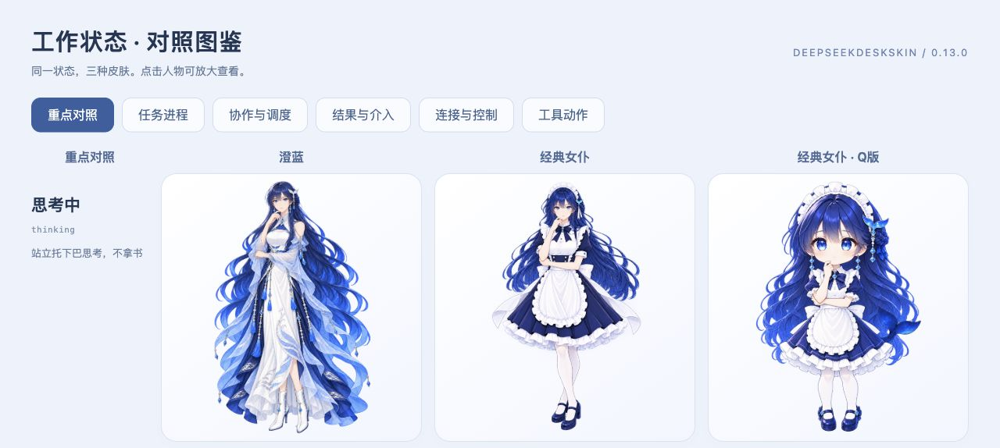

# deepseekdeskskin

独立的 DeepSeek 娘皮肤工作室，为 DeepSeek Harness 添加蓝白配色、角色背景和随任务变化的动作。支持静态与动态模式，也可在没有安装 Harness 的机器上独立预览。



## 功能

- **三套皮肤，各 21 张独立状态图**：思考、查阅、写入、搜索、执行命令、分派、整理书架、回应、完成、错误等使用不同身体动作。
- **新对话开场**：每套 12 张肩上关键帧，约 3.9 秒完成「看向左侧 → 转头 → 对视 → 微笑」。随后恢复身体动作；同一会话的后续追问不重复开场。
- **连续的阅读淡化**：开始交互时突出人物，持续工作后逐渐淡化，完成、报错和等待确认时恢复；小窗口仍保留人物。
- **统一界面**：云间白／深海蓝配色、头像、左侧皮肤入口与滚动导航；装饰层不接收鼠标事件。
- **本地设置与便携皮肤**：可调模式、配色、位置、大小和透明度；支持导入 PNG/JPG/GIF/WebP，以及导入／导出 `.dsskin.json`。
- **19 段非人声音效素材**：可独立试听和下载，当前版本尚未接入客户端自动播放。

本项目不依赖 LLMPET 或 deepseekdesk。仓库只包含皮肤工作室、素材和 Harness 适配器，不包含 LLMPET 的 DSH 改造，也不包含 Harness 客户端源码。

## 独立启动

需要 **Node.js 20+**。无第三方运行时依赖，无需 `npm install`。

```sh
git clone https://github.com/xingxingluolei/deepseekdeskskin.git
cd deepseekdeskskin
npm start
```

打开 [本地工作室](http://127.0.0.1:4178)。macOS 也可双击 `Start.command`。服务仅监听本机，按 `Ctrl+C` 停止；可通过 `PORT` 修改端口。

- [当前状态图鉴](http://127.0.0.1:4178/web/current-state-gallery.html)：三套皮肤的 63 张状态图。
- [音效试听](http://127.0.0.1:4178/web/sound-effects-review.html)：19 段非人声音效与串联试听。
- [角色与界面图鉴](http://127.0.0.1:4178/design)：角色资料、开场帧、配色与界面元素。

工作室仅负责预览与设置，不连接模型或发送对话。配置默认写入 `~/.deepseekdeskskin/settings.json`，自定义图片写入同目录的 `media/`；可用 `DEEPSEEKDESKSKIN_HOME` 指定其他位置。单张导入图片不得超过 8 MB。

## 安装到 DeepSeek Harness

当前版本 **0.13.0**，适配基线为 **DeepSeek Harness 0.2.0-rc.2** 的插件接口。其他版本需要重新验证。

1. 从 [v0.13.0 发行页](https://github.com/xingxingluolei/deepseekdeskskin/releases/tag/v0.13.0) 下载 `deepseekdeskskin-harness-0.13.0.tgz`。
2. 使用 Harness 官方 CLI 安装。macOS 默认安装位置示例：

```sh
"/Applications/DeepSeek Harness.app/Contents/Resources/runtime/cli/bin/dsh" \
  plugin --profile desktop add \
  "$HOME/Downloads/deepseekdeskskin-harness-0.13.0.tgz" --ignore-scripts
```

下载到其他目录时替换包路径。插件由官方 CLI 管理，不修改客户端 `.app`。若界面没有立即刷新，在当前任务结束后退出并重新打开客户端即可，无需退出账号。

安装后，左侧皮肤卡提供 **切换皮肤** 与 **皮肤详情**。导出包已内嵌三套角色及其动作，运行时不需要工作室服务持续开启。关闭皮肤可恢复原生界面；再次启用仍从左侧入口操作。

更新已有安装时，在当前任务结束后先执行下面的卸载命令，再用上面的 `add` 命令安装新包。仅卸载时执行：

```sh
"/Applications/DeepSeek Harness.app/Contents/Resources/runtime/cli/bin/dsh" \
  plugin --profile desktop remove deepseekdeskskin-harness
```

## 状态如何联动

适配器使用 Harness 暴露的会话、流元数据、工具、子任务、后台任务与连接状态，并用 host 回执补充可取得的工具终结信息。不会读取推理正文进行关键词分类。

| 类别 | 状态 |
| --- | --- |
| 会话与回应 | 就绪、思考中、回应中、本轮完成 |
| 工具动作 | 工作中、查阅中、写入中、搜索中、命令执行、任务分派 |
| 协作与调度 | 并行协作、整理上下文、重试中、排队中 |
| 连接与介入 | 连接中、连接中断、等待确认、需要检查、已停止、已暂停、需要介入 |

工具结束不等于整轮完成；打开历史正常会话不会播放完成动作。正常结束先展示完成动作，随后保持回应姿态。已观察到的局部失败短暂显示错误动作，整轮失败保留错误状态；错误、确认和停止等事件会立即中断开场。第三方远程子任务的终结，以及部分已转后台命令的退出信息，并未完整暴露，不通过正文猜测。

动态图像由独立 PNG 关键姿态、双缓冲渐变和轻微镜头运动组成，**不是 Live2D、骨骼动画或连续视频**；不同帧可能存在发丝、衣纹和道具差异。静态模式仍随状态换图，但不播放转场；系统“减少动态效果”也会关闭开场动画。

## 开发与构建

```sh
npm test
npm run build:plugin
```

独立测试不要求安装 Harness；两项原生契约检查需要 `DSH_REFERENCE_ROOT` 指向官方包的只读提取目录，未设置时会跳过。该目录不随本仓库分发。

构建输出 `dist/deepseekdeskskin-harness-0.13.0.tgz` 和可审查的 `dist/harness-plugin/`。默认读取本地工作室的已保存设置；没有设置时使用内置默认值。也可从便携皮肤包构建：

```sh
npm run build:plugin -- /path/to/your-skin.dsskin.json
```

工作室中的“导出 Harness 插件”提供相同功能。音效生成脚本为 `scripts/generate-sfx-v1.py`，仅重新生成音效时需要 Python、NumPy 和 SciPy；正常使用不需要这些依赖。

| 目录 | 内容 |
| --- | --- |
| `src/` | 皮肤目录、人物渲染、开场与动作表现 |
| `adapters/harness/` | Harness 状态订阅、插件界面和构建 |
| `web/` | 独立工作室、图鉴与试听页面 |
| `assets/` | 当前人物图片、头像、设定图及音效 |
| `docs/` | 状态清单、素材清单与生成来源记录 |
| `test/` | 状态、构建、服务器与呈现行为测试 |

## 素材说明

人物为本项目使用 AI 生成的 DeepSeek 娘二创概念，**非 DeepSeek 官方人物或素材**；项目名称不表示官方合作或隶属关系。图片来源与生成过程见 [素材说明](assets/CREDITS.md)，公开包中的文件和校验值见 [素材清单](docs/asset-manifest.json)。来源记录可能涉及已淘汰的参考图，公开版本只打包当前采用的素材。
